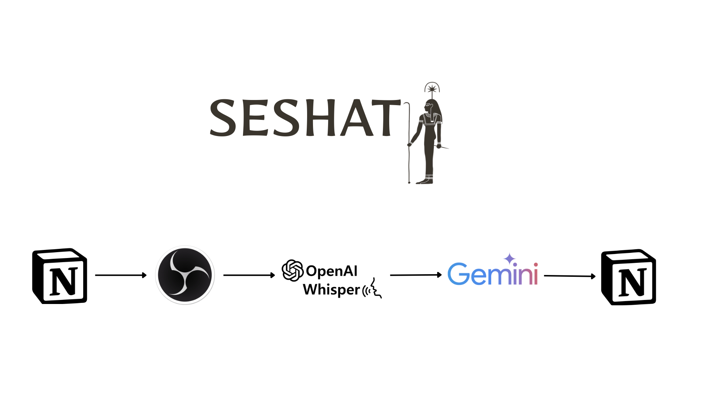
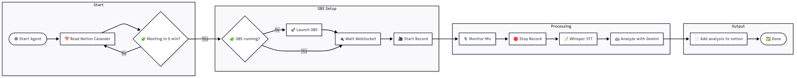

# Seshat-Agent
 AI-powered assistant that documents meetings automatically. Named after the ancient Egyptian goddess of writing and wisdom, Seshat uses speech recognition, language models, and integration with Notion to transcribe, summarize, analyze, and archive your meetings with minimal human input.


---

## Features

- **Automatic Meeting Detection:** Fetches today's meetings from your Notion database.
- **OBS Studio Integration:** Automatically starts and stops screen recording for each meeting.
- **Transcription:** Uses OpenAI Whisper to transcribe meeting recordings.
- **AI Analysis:** Summarizes, extracts action items, deadlines, decisions, and insights using Google Gemini.
- **Notion Integration:** Pushes structured meeting notes and analysis back to your Notion workspace.

---

## Pipeline Overview

1. **Fetch Meetings:** Reads today's meetings from Notion.
2. **Wait & Record:** Waits for each meeting to start, then launches OBS Studio and records the session.
3. **Transcribe:** Converts the recording to audio and transcribes it using Whisper.
4. **Analyze:** Sends the transcript to Gemini for summarization and extraction of key information.
5. **Document:** Creates a detailed meeting page in Notion with all extracted insights.




---

## Tools & Technologies

- **Python 3.9+**
- [notion-client](https://github.com/ramnes/notion-sdk-py): For Notion API integration.
- [google-generativeai](https://github.com/google/generative-ai-python): For Gemini LLM analysis.
- [openai-whisper](https://github.com/openai/whisper): For speech-to-text transcription.
- [obs-websocket-py](https://github.com/Elektordi/obs-websocket-py): For controlling OBS Studio.
- [psutil](https://github.com/giampaolo/psutil): For process management.
- [chardet](https://github.com/chardet/chardet): For encoding detection.
- **OBS Studio** (with WebSocket plugin): For screen recording.
- **ffmpeg**: Required for audio extraction.

---

## Setup

1. **Clone the repository** and navigate to the `ai-meeting-agent` folder.

2. **Install dependencies:**
   ```sh
   pip install -r requirements.txt
   ```

3. **Install system dependencies:**
   - [OBS Studio](https://obsproject.com/) (with [obs-websocket plugin](https://github.com/obsproject/obs-websocket))
   - [ffmpeg](https://ffmpeg.org/) (add to PATH)

4. **Configure environment variables:**
   - Copy `.env` and fill in your Notion token, database ID, OBS connection info, and Gemini API key.

5. **Set up Notion database:**
   - Create a database with at least `Name` (title) and `Date` (date) properties.

---

## Usage

To start the agent, run:

```sh
python agent.py
```

The agent will:
- Continuously check for today's meetings.
- Automatically record, transcribe, analyze, and document each meeting in Notion.

---

## File Structure

```
agent.py                # Main orchestrator loop
calendar_agent.py       # Fetches meetings from Notion
obs_control.py          # OBS Studio automation
transcriber.py          # Whisper-based transcription
summarizer.py           # Gemini-based analysis
notion_writer.py        # Pushes results to Notion
audio_utils.py          # (Reserved for audio helpers)
encoding.py             # File encoding utilities
integrated_meeting_pipeline.py # Example of a single-step pipeline
requirements.txt        # Python dependencies
.env                    # Environment variables (not committed)
recordings/             # Raw meeting recordings
processed/              # Processed (archived) files
transcripts/            # Meeting transcripts
analysis/               # Meeting analysis results
logs/                   # Agent logs
```

---

## Customization

- **Meeting Duration:** Adjust the `meeting_duration` in `agent.py` as needed.
- **Model Size:** Change Whisper model size in `transcriber.py` for faster or more accurate transcription.
- **Prompt Engineering:** Edit prompts in `summarizer.py` for different analysis outputs.

---

## License

MIT License © 2025 Ahmed Soliman (Al-Deeb)

---

## Acknowledgements

- OpenAI for Whisper
- Google for Gemini
- Notion for their API
- OBS Studio for open-source recording

---
